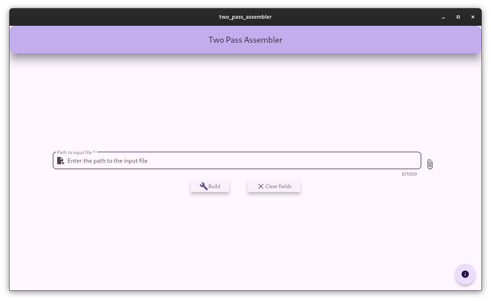
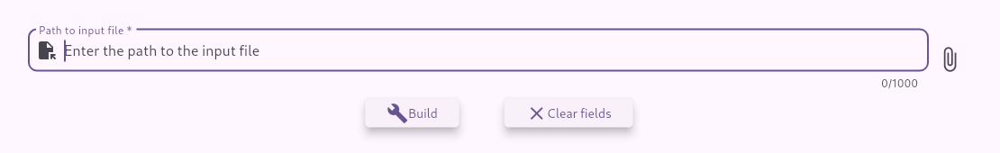

# Two Pass Assembler

## About

Two Pass Assembler is a SIC assember frontend implementing two pass algorithm (Pass 1 and Pass 2) for the SIC architecture.

### Copyright

MIT License

Copyright (c) 2024 aerocyberdev@pm.me

Permission is hereby granted, free of charge, to any person obtaining a copy
of this software and associated documentation files (the "Software"), to deal
in the Software without restriction, including without limitation the rights
to use, copy, modify, merge, publish, distribute, sublicense, and/or sell
copies of the Software, and to permit persons to whom the Software is
furnished to do so, subject to the following conditions:

The above copyright notice and this permission notice shall be included in all
copies or substantial portions of the Software.

THE SOFTWARE IS PROVIDED "AS IS", WITHOUT WARRANTY OF ANY KIND, EXPRESS OR
IMPLIED, INCLUDING BUT NOT LIMITED TO THE WARRANTIES OF MERCHANTABILITY,
FITNESS FOR A PARTICULAR PURPOSE AND NONINFRINGEMENT. IN NO EVENT SHALL THE
AUTHORS OR COPYRIGHT HOLDERS BE LIABLE FOR ANY CLAIM, DAMAGES OR OTHER
LIABILITY, WHETHER IN AN ACTION OF CONTRACT, TORT OR OTHERWISE, ARISING FROM,
OUT OF OR IN CONNECTION WITH THE SOFTWARE OR THE USE OR OTHER DEALINGS IN THE
SOFTWARE.

### Versioning

Version 1.0: Initial release

## Language Considerations

The assembler requires the source to have 3 sections per line separated by tab.

```
LABEL   MNEMONIC    OPERATOR
```

In case of the lack of `LABEL`, it must be filled with `-`. The first line MUST be:

```
LABEL START ADDRESS
```

`LABEL` can be replaced with a suitable label, `ADDRESS` with a HEX value.


The `OPTAB` has been hardcoded so as to reduce the need of taking additional input.

The output of the assembler will be in the `build` subdirectory located in the source program directory.

## Using the assembler

Using the assembler is straight forward.



All that is to be done is to create the source file and provide its path in the input field. Alternatively, save the source file and click on the File Attach button to the right of the input field to open `Open File` dialog box.



Then, click the `Build` button to build.

> Building will create a `build` subdirectory. If it already exist, the entire directory is deleted and then recreated.

Open the directory `build` to see the output.

To clear the path, tap the `Clear fields` button.


## Permanent Links

Source: [https://adi.has.coffee/two-pass-src](https://adi.has.coffee/two-pass-src)

Latest Release: [https://adi.has.coffee/two-pass-rel](https://adi.has.coffee/two-pass-rel)
